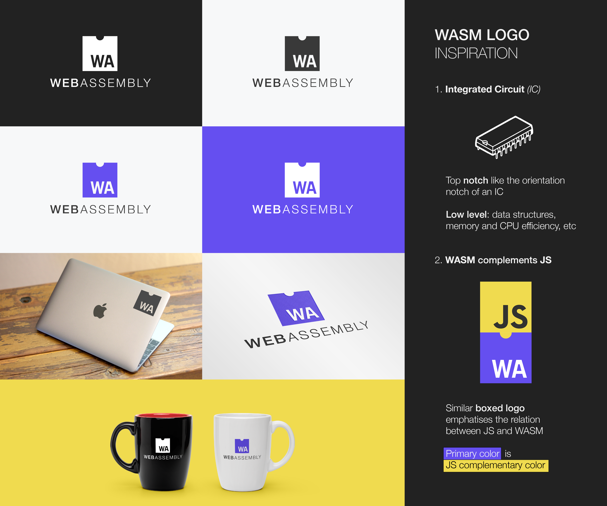
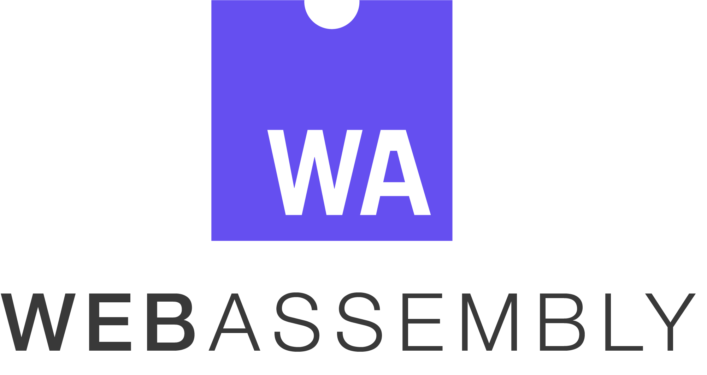
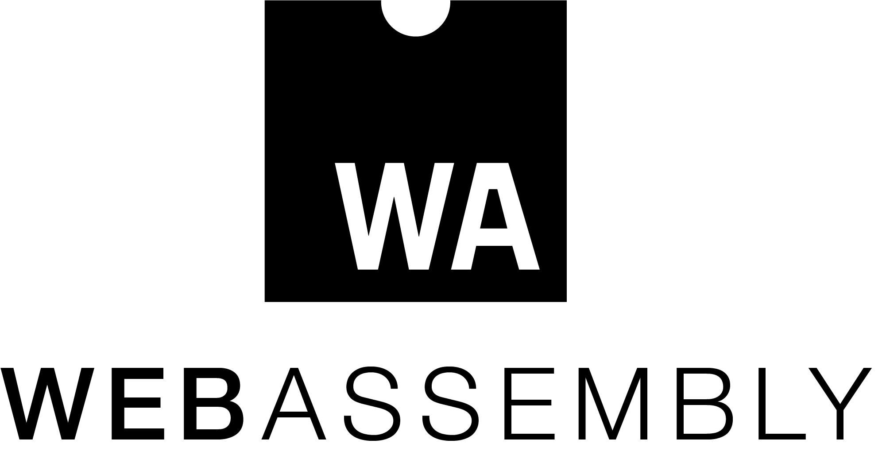

# Web Assembly Logo

* [Link to Web Assembly logo contest](https://github.com/WebAssembly/design/issues/980#issuecomment-278086797)
* [Link to Logo Presentation Repo](https://github.com/carlosbaraza/web-assembly-logo-presentation)

# License
The presented work is entirely Creative Commons licensed. Meaning that anyone could use it, as it is my will to distribute it free of charges.

* [Full license](./LICENSE)
* [Original proposal comment](https://github.com/WebAssembly/design/issues/112#issuecomment-258674675)
