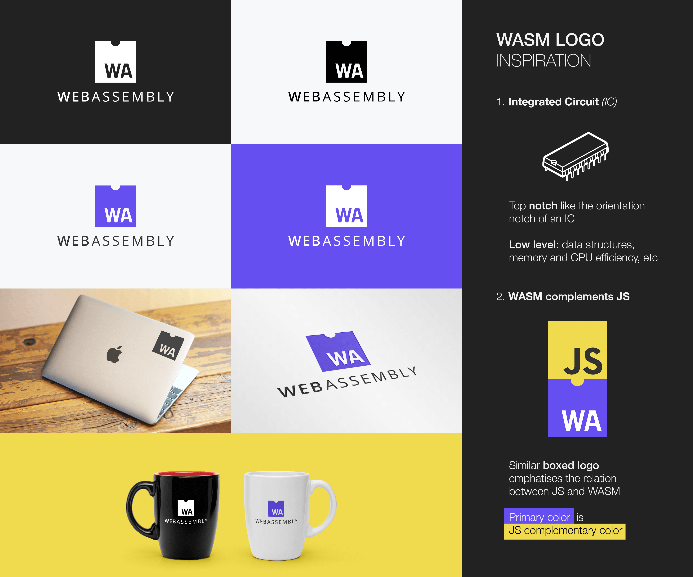
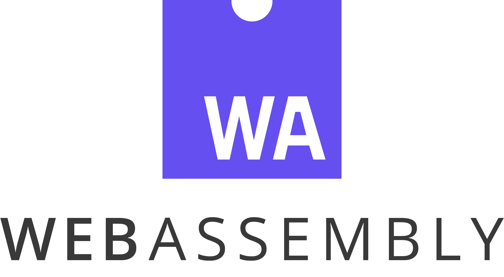
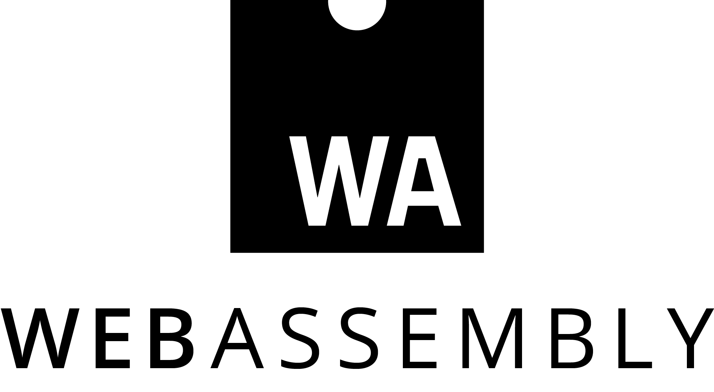

# Web Assembly Logo
* [Link to Web Assembly logo contest.](https://github.com/WebAssembly/design/issues/980#issuecomment-278086797) Feel free to participate and/or vote for my logo.

# License
The presented work is entirely Creative Commons licensed. Meaning that anyone could use it, as it is my will to distribute it free of charges.

* [Full license](./LICENSE)
* [Original proposal comment](https://github.com/WebAssembly/design/issues/112#issuecomment-258674675)
